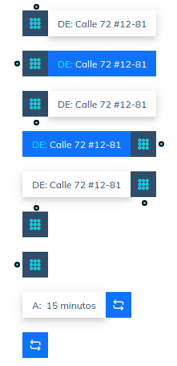

# PackenNg

This library contain all ui components for [Packen](https://packen.co) brand.

## Getting started

To use it first install it:

> npm i packen-ng --save

Then import the module to use its available components in your `app.module.ts` :

``` javascript
import { PackenNgModule } from 'packen-ng';

@NgModule({
    declarations: [],
    imports: [
        PackenNgModule
    ],
    providers: []
})
```

## Available components

The **PackenNgModule** contain follow components:

>
> * [PinMapComponent](###PinMapComponent)
> * ButtonsComponent
> * AvatarsComponent
> * DividersComponent
> * TabsComponent
> * CheckboxComponent
> * RadioComponent
> * TogglesComponent
> * InputsComponent
> * DropdownsComponent
>

## How to use each component

### PinMapComponent

#### Description

``` 
This component represent a marker inside a map (google map).
```

#### Use it in HTML

``` html
<app-packen-pin-map typeIcon="default" icon="icon-keypad" type="active" [label]="'somelabel" [direction]="somedescription" iconPosition="left" dotPosition="down">
</app-packen-pin-map>
```

#### Component appearance



#### Options

 - **typeIcon**: It defines the content of the smallest box. Posibles values to use: <span style="color:blue">*(default|icon|letter)*</span>.
 - **type**: It defines the style of the largest box. Posibles values to use: *(default|active|refresh)*.
 - **icon**: It puts the icon to show inside the small box. It should be used with *typeIcon=icon*.
 - **letter**: It puts a letter to show inside the small box. It should be used with *typeIcon=letter*.
 - **iconPosition**: It defines where the small box will be. Posibles values to use: *(left|right)*.
 - **dotPosition**: It represents a small point arround the small box. The value to specify indicate where this point will be. Posibles values to use: *(left|right|top|down|none)*. **NOTE**: If the value is *none*, the point does not appear.
 - **label**: It defines a prefix for the content that will show in the largest box.
 - **direction**: It defines the content that will show in the largest box. **NOTE**: If this value and *letter* value are empty, the largest box does not appear.
 - **letter**: It defines the content that will show in the largest box.**NOTE**: If this value and *direction* value are empty, the largest box does not appear.
